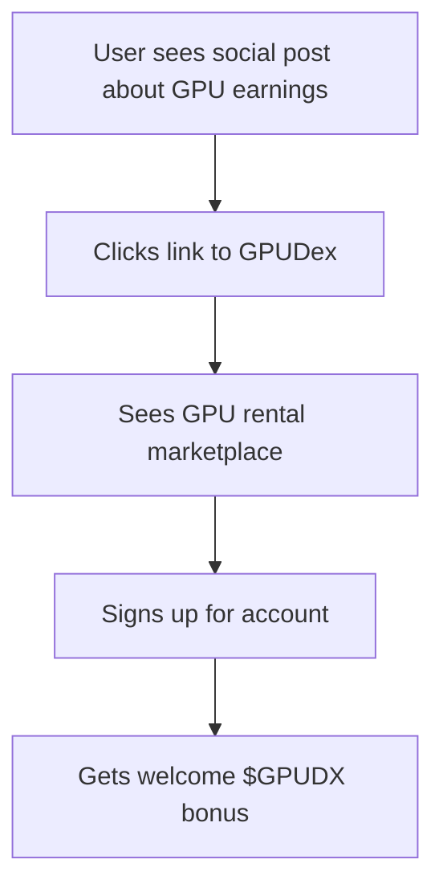
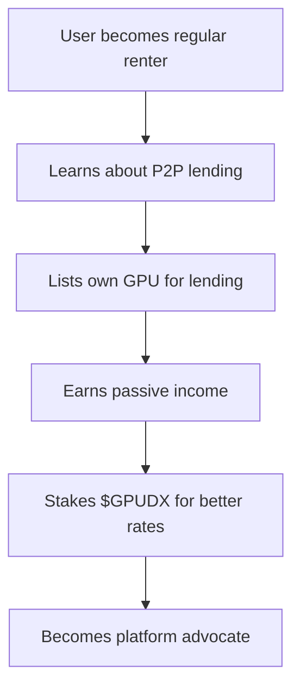
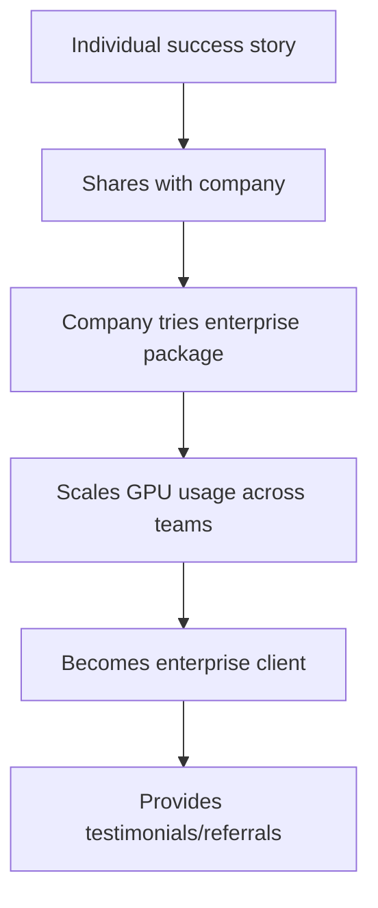

# 🚀 GPUDex Unified Platform Strategy - GPU Rentals as Foundation

## 🎯 **CORE MISSION: THE WORLD'S ULTIMATE GPU MARKETPLACE**

**Foundation**: GPU Rental Platform (B2B + B2C)  
**Amplification**: P2P Lending + $GPUDX Staking + Social Rewards  
**Result**: Complete GPU Compute Ecosystem

---

## 🏗️ **PLATFORM ARCHITECTURE (GPU-Centric)**

### **🎮 CORE FOUNDATION: GPU RENTAL MARKETPLACE**

#### **Primary Revenue Streams**
```typescript
interface GPUBusinessModel {
  b2b_enterprise: {
    target: "AI/ML companies, gaming studios, crypto miners";
    pricing: "$0.50-3.00/hour per GPU";
    volume: "24/7 high-utilization rentals";
    margins: "15-25% platform fee";
  };
  
  b2c_individual: {
    target: "Developers, researchers, content creators";
    pricing: "$0.25-1.50/hour per GPU";
    volume: "Project-based, burst computing";
    margins: "10-15% platform fee";
  };
  
  p2p_marketplace: {
    target: "Individual GPU owners lending to platform";
    pricing: "Dynamic market-based pricing";
    volume: "Idle GPU monetization";
    margins: "5-10% platform fee";
  };
}
```

#### **GPU Provider Network**
```python
class GPUProviderEcosystem:
    def __init__(self):
        # Tier 1: Enterprise Partners (80% of compute power)
        self.enterprise_providers = {
            "vast_ai": "Primary integration - 1000+ GPUs",
            "runpod": "Secondary provider - 500+ GPUs", 
            "lambda_labs": "Specialized ML workloads - 300+ GPUs",
            "aws_ec2": "Enterprise tier - P4/P5 instances",
            "gcp_compute": "Global availability - T4/V100/A100",
            "azure_ml": "Enterprise AI workloads"
        }
        
        # Tier 2: P2P Individual Providers (20% of compute power)
        self.p2p_providers = {
            "individual_miners": "RTX 4090, 4080, 3090 owners",
            "small_farms": "5-20 GPU operations",
            "gaming_rigs": "Part-time GPU sharing",
            "student_labs": "University GPU access"
        }
```

---

## 💎 **SUPPORTING ECOSYSTEM: $GPUDX TOKEN INTEGRATION**

### **🏆 Token Utility (GPU-Focused)**

#### **1. GPU Rental Discounts & Payments**
```python
class GPUDXTokenUtility:
    def __init__(self):
        self.payment_benefits = {
            "gpu_rental_discount": "5-15% off when paying with $GPUDX",
            "priority_access": "Skip queue during high demand",
            "bulk_discounts": "Additional 10% off for large rentals",
            "loyalty_rewards": "Earn 2% back in $GPUDX on all rentals"
        }
        
        self.staking_benefits = {
            "bronze_tier": {"stake": "1K $GPUDX", "discount": "5%", "priority": "Low"},
            "silver_tier": {"stake": "10K $GPUDX", "discount": "10%", "priority": "Medium"},
            "gold_tier": {"stake": "100K $GPUDX", "discount": "15%", "priority": "High"},
            "diamond_tier": {"stake": "1M $GPUDX", "discount": "20%", "revenue_share": "1%"}
        }
```

#### **2. P2P GPU Provider Incentives**
```typescript
interface P2PProviderRewards {
  earnings_boost: {
    "100_gpudx_staked": "+5% rental earnings",
    "1000_gpudx_staked": "+10% rental earnings", 
    "10000_gpudx_staked": "+15% rental earnings"
  };
  
  platform_benefits: {
    "priority_listing": "Your GPUs shown first in search",
    "verified_provider": "Trust badge + higher rates",
    "instant_payouts": "Get paid immediately, not weekly",
    "premium_support": "Dedicated provider support team"
  };
}
```

---

## 📱 **SOCIAL AMPLIFICATION: DRIVING GPU BUSINESS**

### **🎯 Social Rewards Refocused on GPU Business**

#### **GPU-Centric Social Challenges**
```yaml
social_challenges_gpu_focused:
  monday_setup_showcase:
    theme: "Show your GPU rental setup/results"
    reward: "25 $GPUDX + 10% off next rental"
    business_impact: "Drives rental demonstrations"
    
  tuesday_tutorial_sharing:
    theme: "Share GPU optimization tips/tutorials"  
    reward: "30 $GPUDX + provider verification boost"
    business_impact: "Educational content builds trust"
    
  wednesday_earnings_wednesday:
    theme: "Share your P2P GPU lending earnings"
    reward: "40 $GPUDX + staking bonus"
    business_impact: "Attracts more GPU providers"
    
  thursday_project_spotlight:
    theme: "Showcase projects built with rented GPUs"
    reward: "50 $GPUDX + enterprise lead referral"
    business_impact: "Demonstrates platform value"
    
  friday_provider_spotlight:
    theme: "Highlight successful GPU providers"
    reward: "35 $GPUDX + provider bonus"
    business_impact: "Recruits more P2P providers"
```

#### **Achievement System (GPU Business-Driven)**
```python
class GPUBusinessAchievements:
    def __init__(self):
        # GPU Rental Achievements
        self.rental_achievements = {
            "first_rental": {"reward": "50 $GPUDX", "business": "Onboards new renters"},
            "power_user": {"reward": "200 $GPUDX", "unlock": "100+ hours rented"},
            "enterprise_client": {"reward": "1000 $GPUDX", "unlock": "$1000+ spent"},
            "ml_researcher": {"reward": "500 $GPUDX", "unlock": "50+ ML workloads"}
        }
        
        # P2P Provider Achievements
        self.provider_achievements = {
            "first_lender": {"reward": "75 $GPUDX", "business": "Onboards GPU providers"},
            "reliable_provider": {"reward": "300 $GPUDX", "unlock": "95% uptime"},
            "high_earner": {"reward": "1500 $GPUDX", "unlock": "$500+ earned"},
            "community_favorite": {"reward": "2000 $GPUDX", "unlock": "4.8+ rating"}
        }
        
        # Staking Achievements  
        self.staking_achievements = {
            "diamond_hands": {"reward": "250 $GPUDX", "unlock": "6 month stake"},
            "whale_staker": {"reward": "5000 $GPUDX", "unlock": "100K+ staked"},
            "yield_master": {"reward": "1000 $GPUDX", "unlock": "1 year staking"}
        }
```

---

## 🏢 **ENTERPRISE INTEGRATION (B2B Focus)**

### **🎯 Enterprise GPU Solutions**

#### **AI/ML Company Packages**
```typescript
interface EnterpriseGPUPackages {
  startup_package: {
    target: "AI startups, small ML teams";
    offering: "20-100 GPU hours/month";
    pricing: "$500-2500/month";
    benefits: ["Priority support", "Flexible scaling", "$GPUDX rewards"];
  };
  
  scale_up_package: {
    target: "Growing AI companies";
    offering: "500-2000 GPU hours/month"; 
    pricing: "$2500-10000/month";
    benefits: ["Dedicated account manager", "Custom configs", "Bulk discounts"];
  };
  
  enterprise_package: {
    target: "Large corporations, research institutions";
    offering: "Unlimited GPU access";
    pricing: "$25000+/month";
    benefits: ["Private GPU clusters", "SLA guarantees", "Revenue sharing"];
  };
}
```

#### **Social Amplification for Enterprise**
```python
class EnterpriseMarketingAmplification:
    def __init__(self):
        self.social_strategies = {
            "case_studies": "Enterprise clients share success stories",
            "technical_content": "Engineers post optimization techniques", 
            "roi_demonstrations": "CFOs share cost savings achieved",
            "innovation_showcase": "CTOs highlight breakthrough projects"
        }
        
        self.reward_structure = {
            "enterprise_testimonial": "1000 $GPUDX + platform credits",
            "technical_deep_dive": "500 $GPUDX + consulting opportunity",
            "roi_case_study": "2000 $GPUDX + enterprise referral bonus"
        }
```

---

## 🔄 **UNIFIED USER JOURNEY (GPU-Centric)**

### **🎯 Customer Acquisition → Retention → Expansion**

#### **Phase 1: Discovery (Social-Driven)**


#### **Phase 2: First Value (GPU Rental)**
```mermaid
graph TD
    A[User browses available GPUs] --> B[Tries small rental (discounted)]
    B --> C[Completes first project successfully]
    C --> D[Shares experience on social media]
    D --> E[Earns $GPUDX social rewards]
    E --> F[Uses rewards for next rental]
```

#### **Phase 3: Engagement (P2P + Staking)**


#### **Phase 4: Expansion (Enterprise)**


---

## 📊 **UNIFIED REVENUE MODEL**

### **💰 Primary Revenue (GPU Rentals - 80% of income)**
```python
class UnifiedRevenueStreams:
    def __init__(self):
        # Core GPU Rental Business (Primary)
        self.gpu_rental_revenue = {
            "b2b_enterprise": {"monthly": "$500K-2M", "margin": "20%"},
            "b2c_individual": {"monthly": "$100K-500K", "margin": "15%"},
            "platform_fees": {"monthly": "$50K-200K", "margin": "95%"}
        }
        
        # P2P Marketplace (Secondary)
        self.p2p_revenue = {
            "provider_fees": {"monthly": "$25K-100K", "margin": "10%"},
            "verification_services": {"monthly": "$5K-25K", "margin": "80%"}
        }
        
        # Token Ecosystem (Supporting)
        self.token_revenue = {
            "staking_fees": {"monthly": "$10K-50K", "margin": "90%"},
            "premium_features": {"monthly": "$15K-75K", "margin": "85%"},
            "enterprise_consulting": {"monthly": "$25K-100K", "margin": "70%"}
        }
```

### **📈 Growth Multipliers**
```typescript
interface GrowthMultipliers {
  social_amplification: {
    user_acquisition_cost: "Reduced by 60% vs paid ads";
    referral_rate: "Each user brings 2.5+ friends";
    content_marketing: "User-generated success stories";
    brand_awareness: "Organic social media mentions";
  };
  
  token_incentives: {
    customer_retention: "+40% vs traditional platforms";
    average_order_value: "+25% when paying with $GPUDX";
    enterprise_contracts: "+30% larger deals with staking";
    provider_acquisition: "+50% more P2P providers";
  };
}
```

---

## 🎯 **INTEGRATED MARKETING STRATEGY**

### **🚀 GPU-Focused Content Amplification**

#### **Content Themes (All Lead to GPU Rentals)**
```yaml
content_strategy:
  ai_ml_success_stories:
    content: "How I trained my AI model for $50 using GPUDex"
    cta: "Try GPU rentals starting at $0.25/hour"
    reward: "50 $GPUDX + 20% off first rental"
    
  gaming_development:
    content: "Rendered my game cinematics in 2 hours vs 2 days"
    cta: "Rent RTX 4090 for your projects"
    reward: "75 $GPUDX + gaming GPU discount"
    
  crypto_mining_optimization:
    content: "Earning $200/month lending my RTX 4080"
    cta: "Join our P2P GPU marketplace"
    reward: "100 $GPUDX + provider verification"
    
  research_breakthroughs:
    content: "Published my research thanks to affordable GPU access"
    cta: "Academic discounts available"
    reward: "Research grant consideration"
```

#### **Influencer Partnerships (GPU-Focused)**
```python
class GPUInfluencerStrategy:
    def __init__(self):
        self.target_influencers = {
            "ai_ml_creators": {
                "focus": "Show AI training on rented GPUs",
                "compensation": "Free GPU credits + $GPUDX",
                "kpi": "GPU rental conversions"
            },
            "gaming_developers": {
                "focus": "Game development with cloud GPUs", 
                "compensation": "Revenue share + platform credits",
                "kpi": "Enterprise gaming studio signups"
            },
            "crypto_educators": {
                "focus": "P2P GPU lending education",
                "compensation": "$GPUDX staking rewards",
                "kpi": "New GPU provider registrations"
            }
        }
```

---

## 🏆 **SUCCESS METRICS (GPU Business-Focused)**

### **📊 Core Business KPIs**
```python
class GPUBusinessMetrics:
    def __init__(self):
        # Primary GPU Rental Metrics
        self.core_metrics = {
            "gpu_utilization_rate": {"target": "85%", "current": "72%"},
            "average_rental_duration": {"target": "6 hours", "current": "4.2 hours"},
            "customer_acquisition_cost": {"target": "$25", "current": "$42"},
            "customer_lifetime_value": {"target": "$500", "current": "$285"},
            "enterprise_contract_value": {"target": "$50K avg", "current": "$32K avg"}
        }
        
        # P2P Marketplace Metrics
        self.p2p_metrics = {
            "active_gpu_providers": {"target": "5000", "current": "1200"},
            "provider_earnings_avg": {"target": "$150/month", "current": "$89/month"},
            "gpu_onboarding_rate": {"target": "100/week", "current": "45/week"}
        }
        
        # Token Ecosystem Metrics  
        self.token_metrics = {
            "staking_participation": {"target": "40%", "current": "12%"},
            "token_payment_adoption": {"target": "25%", "current": "8%"},
            "social_driven_signups": {"target": "30%", "current": "5%"}
        }
```

### **🎯 90-Day Launch Targets**
```typescript
interface LaunchTargets {
  month_1: {
    gpu_hours_rented: 10000;
    active_providers: 500;
    enterprise_clients: 5;
    social_amplification_signups: 200;
  };
  
  month_2: {
    gpu_hours_rented: 25000;
    active_providers: 1500;
    enterprise_clients: 15;
    social_amplification_signups: 800;
  };
  
  month_3: {
    gpu_hours_rented: 50000;
    active_providers: 3000;
    enterprise_clients: 30;
    social_amplification_signups: 2000;
  };
}
```

---

## 🚀 **IMPLEMENTATION PRIORITY (GPU-First)**

### **🎯 Phase 1: GPU Rental Foundation (Week 1-4)**
```yaml
priority_1_gpu_core:
  - Optimize GPU provider integrations (Vast.ai, RunPod, Lambda)
  - Enterprise onboarding flow (B2B sales process)
  - P2P GPU provider registration and verification
  - GPU rental marketplace UI/UX optimization
  - Pricing algorithm for dynamic GPU rates
  - Enterprise contract management system
```

### **🎯 Phase 2: Token Integration (Week 5-8)**
```yaml
priority_2_token_ecosystem:
  - $GPUDX payment integration for GPU rentals
  - Staking system with tier-based benefits
  - P2P provider reward distribution
  - Token-based loyalty program
  - Enterprise token payment options
  - Yield farming for GPU providers
```

### **🎯 Phase 3: Social Amplification (Week 9-12)**
```yaml
priority_3_social_growth:
  - GPU-focused social challenge system
  - Achievement system for rentals/providing
  - Referral program with GPU credits
  - User-generated content campaigns
  - Influencer partnership program
  - Community-driven provider verification
```

---

## 💎 **COMPETITIVE ADVANTAGE SUMMARY**

### **🏆 What Makes GPUDex Unstoppable**
```python
class CompetitiveAdvantages:
    def __init__(self):
        self.unique_value_props = {
            "unified_ecosystem": "Rental + P2P + Staking + Social in one platform",
            "gpu_owner_monetization": "First platform to truly reward GPU ownership",
            "enterprise_crypto_bridge": "Bridge between crypto incentives and B2B needs",
            "community_driven_growth": "Users become advocates through token rewards",
            "trust_based_verification": "Honor system reduces costs, builds community",
            "full_stack_solution": "End-to-end GPU compute ecosystem"
        }
        
        self.moats = {
            "network_effects": "More users = more GPUs = better prices",
            "token_flywheel": "Token utility increases with platform usage",
            "data_advantages": "GPU performance and pricing intelligence",
            "community_loyalty": "Token holders invested in platform success",
            "enterprise_relationships": "B2B contracts create stable revenue base"
        }
```

---

## 🎯 **FINAL UNIFIED VISION**

**GPUDex isn't just a GPU rental platform - it's the complete GPU compute ecosystem where:**

✅ **Enterprises** get the best GPU prices and reliability for AI/ML workloads  
✅ **Individuals** can rent GPUs for projects and earn from their idle hardware  
✅ **Token holders** get real utility and rewards tied to actual GPU business  
✅ **Community** grows organically through authentic success stories  
✅ **Everyone wins** in a sustainable, profitable, value-creating ecosystem  

**The social gamification isn't the business - it's the rocket fuel that propels the GPU rental business to dominance.** 🚀💎

**Ready to build the ultimate GPU marketplace with Bill Gates-level strategic thinking!** ⚡ 